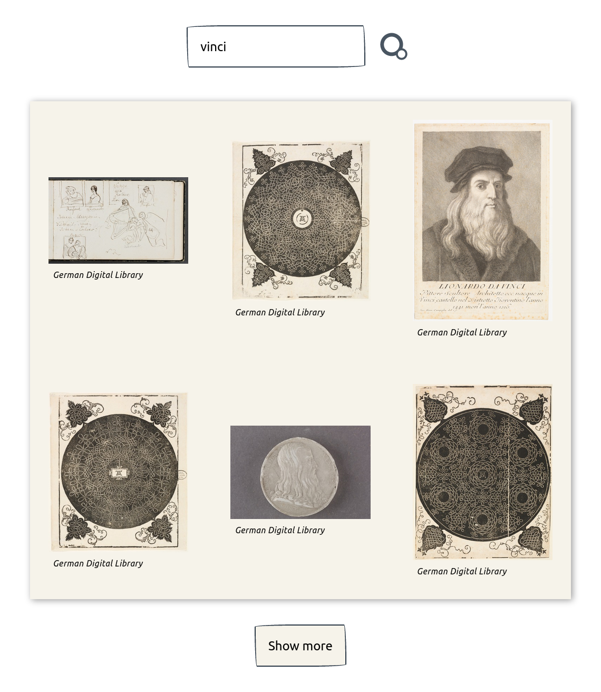

# Europeana search API

## Table of contents

- [Overview](#overview)
  - [The challenge](#the-challenge)
  - [Screenshot](#screenshot)
  - [Links](#links)
- [My process](#my-process)
  - [Built with](#built-with)
- [Author](#author)

## Overview

### The challenge

Users should be able to search for metadata records and media on the Europeana repository.

### Screenshot

### How to use it

To start using the API you need to register for a key at the [registration page](https://pro.europeana.eu/pages/get-api).
Provide an access key in .env file as REACT_APP_EUROPEANA_KEY variable.

## My process

### Built with

- Semantic HTML5 markup
- CSS custom properties
- Flexbox
- CSS Grid
- Mobile-first workflow
- [React](https://reactjs.org/) - JS library

### What I've learned

- How to use React Context with Reducer for fetching data
- How to use CSS modules
- How to make more accessibile application
- Using CSS steps() in animation

## Author

jolka_ef
